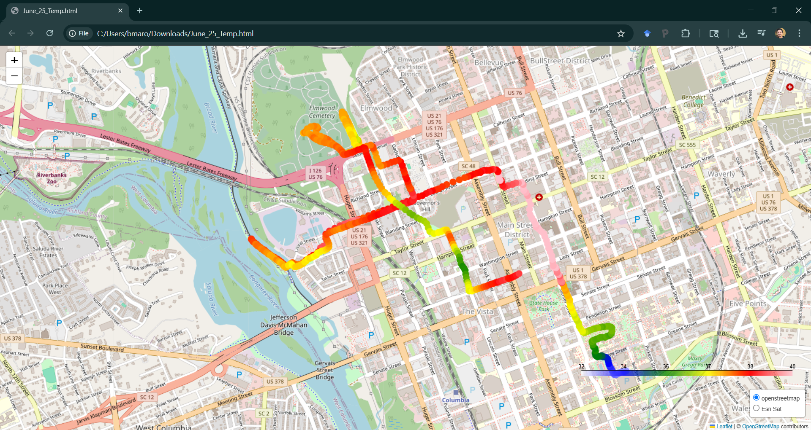

# Heat Mapping Project

This is a Python-based project to capture temperature and humidity data using a Raspberry Pi. This repo includes the main script for data capture, setup instructions, and test scripts for development and debugging.



## 📦 Project Structure

```
heat-project/
 |--- README.md          <-- You are here.
 |--- src/               <-- Main  Python Scripts
 | |--- capture_data.py  <-- Main Script
 |--- test_scripts/      <-- tests
 |--- data/              <-- Data Repo
 |--- docs/              <-- Setup instructions and images
 | |--- setup_instructions.md
 | |--- images/
 |--- env/               <-- vitural environment for Python
 |--- requirement.txt    <-- Python dependencies
 |--- .gitignore         <-- 
```


## 🚀 Quick Start
Assuming you have a Raspberry Pi all set up...
### 1. Clone the repository

```bash
git clone https://github.com/YOUR_USERNAME/heat-project.git
cd heat-project
```
### 2. Create and activate a virtual environment
```bash
python -m venv env
source env/bin/activate
```
After you activate your virtual environment you should notice `(env)` in your console. Keep it activated now, but if you want, you can deactivate your virtual environment by running `deactivate`.

### 3. Install Dependencies
```bash 
pip install -r requirements.txt
```

### 4. Run the data capture script
```bash
python src/capture_data.py
```

## 🛠 Hardware Setup
Here is a basic wiring diagram for connecting the sensors to the 


More setup details can be found in [docs/setup_instructions.md](docs/setup_instructions.md).

