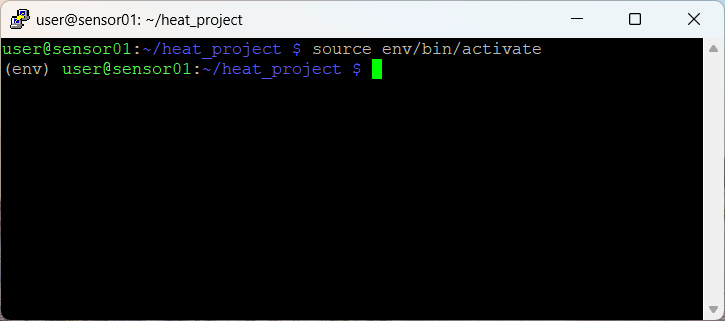

If you chose to create the directory from scratch. You will follow these instructions. 

### Create our directory
Find a specific place where you want to create your own directory for our project. Use the `mkdir` command to create your `heat_project` folder. 

```bash
mkdir heat_project
```
Create a virtual environment.
```bash
python3 -m venv env
```

This will take a minute, but will create a new virtual environment (env), or container, to store python packages. If you run the command ls you will see a new folder called env.



You can activate your virtual env by running the command

```bash
source env/bin/activate
```

You will notice your environment out infront of your user@sensorname:

You can deactivate the virtual environment by running the command `deactive` in the terminal, but keep it **activate** for now.


Install circuit python libraries – Credit to <https://learn.adafruit.com/circuitpython-on-raspberrypi-linux/installing-circuitpython-on-raspberry-pi>

cd ~

pip3 install --upgrade adafruit-python-shell

wget <https://raw.githubusercontent.com/adafruit/Raspberry-Pi-Installer-Scripts/master/raspi-blinka.py>

sudo -E env PATH=$PATH python3 raspi-blinka.py

Y to reboot

pip install RPi.GPIO # for some reason RPi.GPIO does not install and is needed.