This document will walk you through installation of a Raspberry Pi and setting it up for our heat mapping project. Following it straight through will probably take between 1-2 hours. 

Before you begin, it is helpful to download [**Raspberry Pi Imager**](https://www.raspberrypi.com/software/), [**PuTTY**](https://www.putty.org/), and [**VNC Viewer**](https://www.realvnc.com/en/connect/download/viewer/?lai_vid=3BnGRKjX1C6KJ&lai_sr=0-4&lai_sl=l&lai_p=1&lai_na=713940).

## Quick Note

There are options for initial setup. The official documentation can be found [here](https://www.raspberrypi.com/documentation/computers/getting-started.html) and is great. You can connect your Pi with keyboard and mouse, but I like to do the headless install. If you choose to do this make sure you when you image your SD card, you enter your WiFi credentials and enable SSH. I also ran into some issues connecting to WiFi automatically. You can follow my work around for that [here](correcting_wifi.md)

To be consistent, I have been using the following user name and password.

**USER: user**

**PASSWORD: user**

# Raspberry Pi Initial Setup

## Install OS on boot device (SD Card)

Launch [**Raspberry Pi Imager**](https://www.raspberrypi.com/software/)

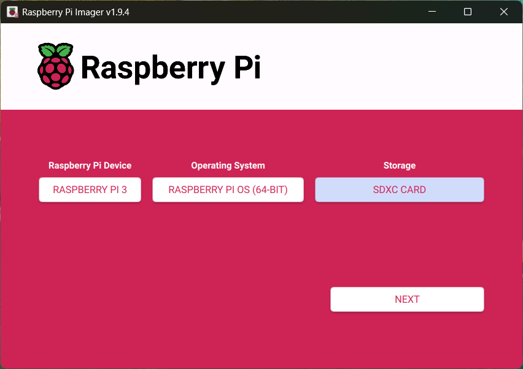

Select your Raspberry Pi Device (_Raspberry Pi 3_), Operating System (I chose the recommended option, _Raspberry Pi OS (64-bit)_) and Storage Device (_SD Card_).

Click `Next`

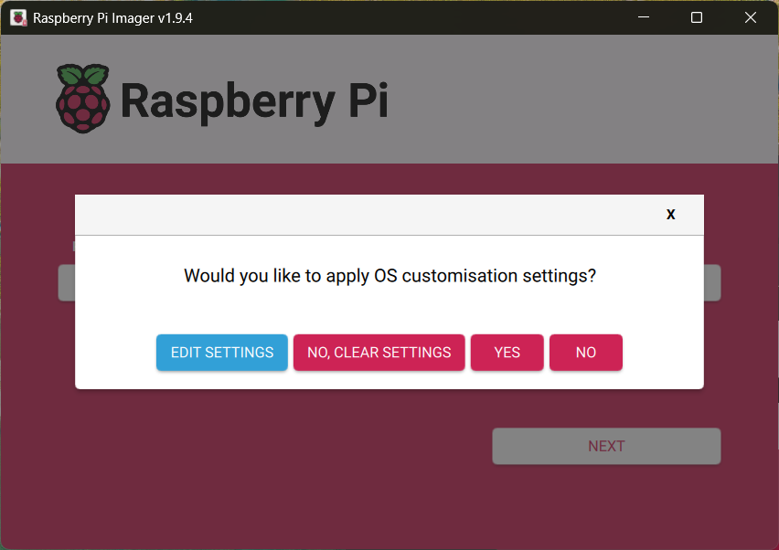

Click `Edit Settings` and provide your Raspberry Pi a name, and provide a username `user` and password `user`. I suggest trying to configure your WIFI now using the `Configure Wireless LAN` option. Mine is York in this example. 

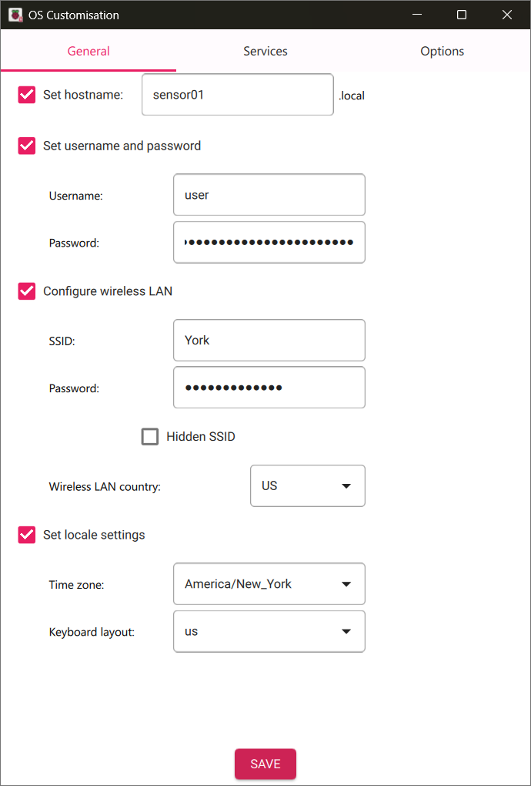

Go ahead and enable SSH under Services so we can connect using `user` `user` through [**PuTTY**](https://www.putty.org/).

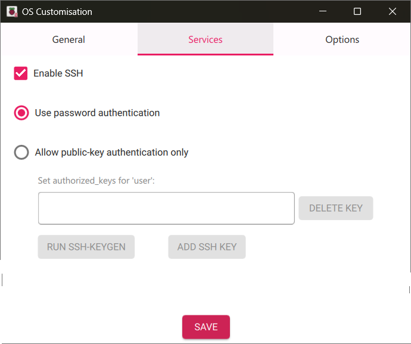


It will take a few minutes to flash your SD Card. When it is complete, 

### Connect to Raspberry Pi using PuTTY or with a monitor and keyboard.

If connecting via [**PuTTY**](https://www.putty.org/) on your machine. Add your Raspberry Pi's IP address or Host Name. You should have programmed the Host Name in the Imaging process. You can try to ping that device to get the IP address or you can just try to use the name. You may have to add `@local` to the end of the name like... `hostname@local`.

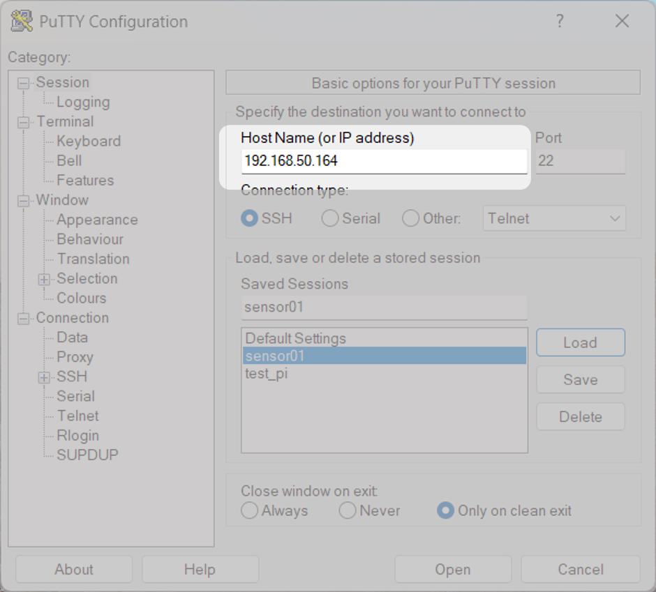

Log in. You will enter the username and then the password. The terminal will not show your password as you log in. Just type it in and press enter.

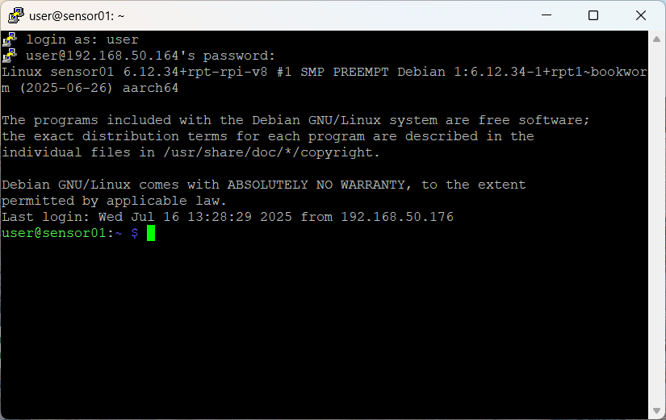


### Check for Updates - *This may take a while*.

```sh
sudo apt update
sudo apt upgrade
```
You may be prompted to confirm or deny any installations. Type `Y` to confirm installation. 

You can let it sit or watch the screen, it will likely take a few minutes. 
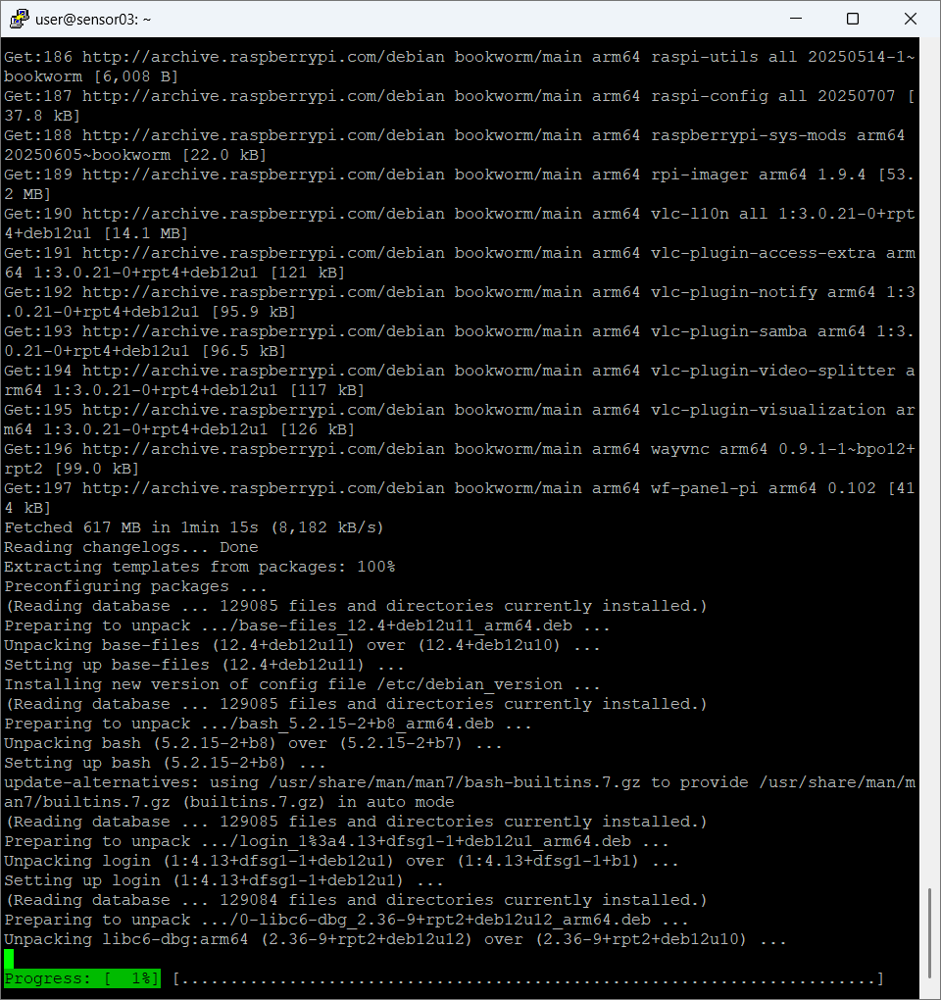
**this could take 15 to 30 minutes dependening on your network.*

### Open Raspberry Pi Software Configuration Tool 
Next we need to enable some interface options so we can remote into the machine and communicate with sensors. 

In the termianl type 
```bash
sudo raspi-config
```

The terminal will change to the *Raspberry Pi Software Configuration Tool (raspi-config)*. You will not be able to use your mouse cursor. Naviage with your directional keys on your keyboard. 

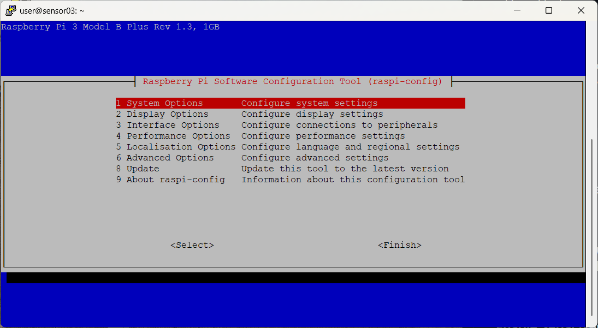


### Enable VNC (to access it remotely through VNC Viewer).
Navigate to `Interface Options`. Move down to **VNC**. 


Press `Enter` on your keyboard. Select `<Yes>` to enable VNC. 

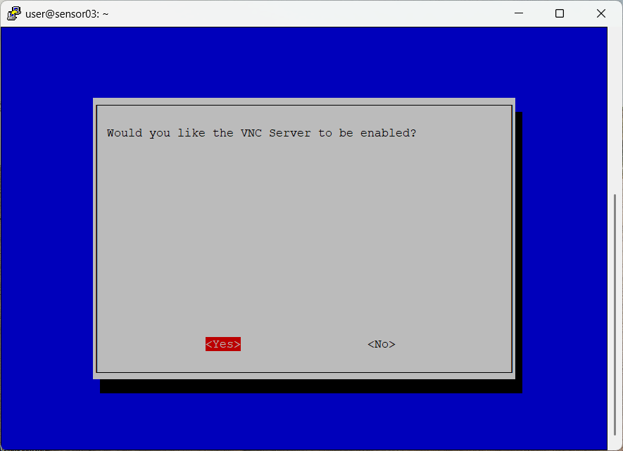

You may see the screen go back to the terminal. Then you will see a message saying `The VNC Server is enabled`. Click `<Ok>`


### Enable I<sup>2</sup>C (two-wire serial communication protocol used to connect the temperature and humidity sensors).
Navigate to `Interface Options`. Move down to **I2C**. 

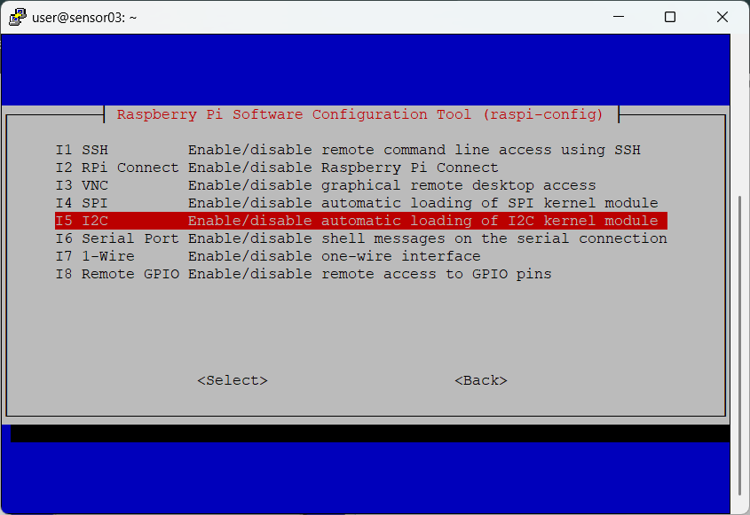

Press `Enter` on your keyboard. Select `<Yes>` to enable I2C interface. 

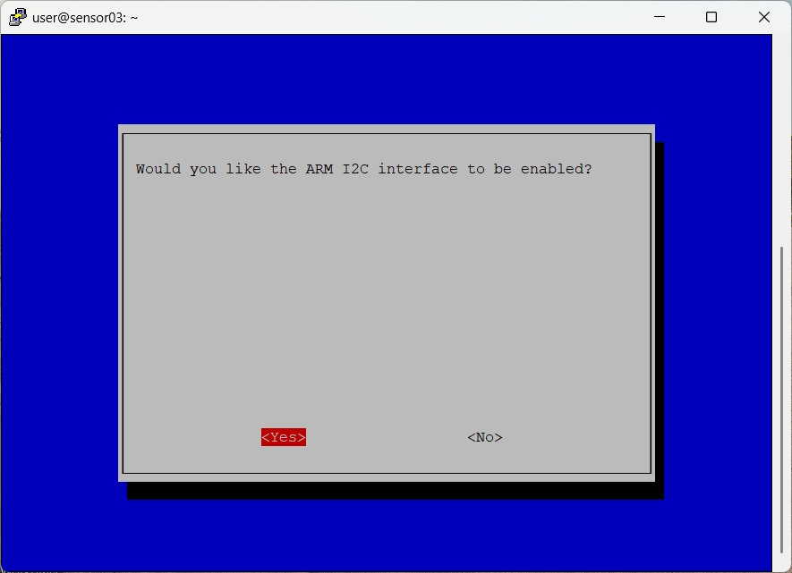

You may see the screen go back to the terminal. Then you will see a message saying ` The ARM I2C interface is enabled `. Click `<Ok>`


### Enable Serial Interface for GPS.
Navigate to `Interface Options`. Move down to **Serial Port**. 

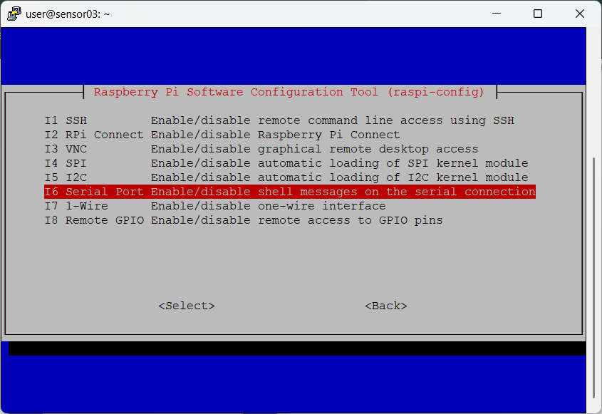

Press `Enter` on your keyboard. Select `<No>` to enabling the login shell.

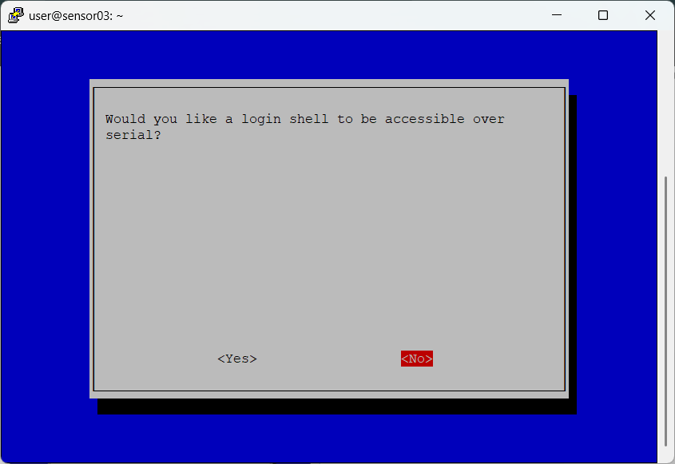

Select `<Yes>` to enable serial port hardware. 

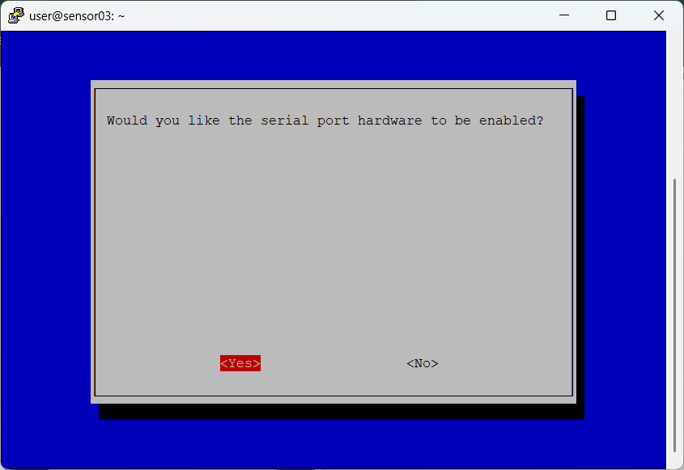

You may see the screen go back to the terminal. Then you will see a message saying ` The serial login shell is disabled` and `The serial interface is enabled `. 
 
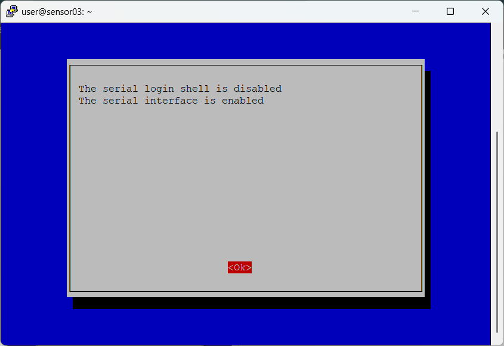

Click `<Ok>`. Now you are free to select `<Finish>`

### Reboot
If you are prompted, you can reboot the Pi. If not it is good practice to reboot now. Run the command `sudo restart`. 

## Clone the directory from GitHub
Once the Pi has restarted. Log in using PuTTy just as before. In the terminal you will be in the root directory for your user. If you are curious about what is in your current working directory, run the `ls` command to list all files and folders. 

We will use git to clone our directory from online. 

```bash
git clone https://github.com/marositesUSC/heat_project.git
```

Now if you run `ls` you will see a new folder named `heat_project`. Next you will run the `cd` command to move into our `heat_project` folder. 

```bash
cd heat-project
```

### Create and activate a virtual environment
We will use virtual environments to keep our python packages tidy and make it easier to share and troubleshoot. Run the following command to create your virtual environment named `env`. 

```bash
python -m venv env
```

You will now see a new folder labeld `env` in the `heat_project` folder. This is your virtual environment. It will contain all the required Python libraries. 

From the `heat_project` folder. Run the following command to activate your virtual environment. 

```bash
source env/bin/activate
```

You will notice your environment out infront of your user@sensorname:

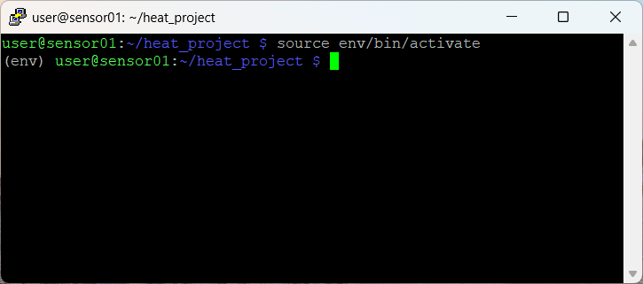

You can deactivate the virtual environment by running the command `deactive` in the terminal, but keep it **activate** for now so we can install the dependencies and activate it any time in the future when you are trying to run our Python Scripts. 

### 3. Install Dependencies
In the cloned GitHub repository is a `requirements.txt` file. This file gives `pip` all of the required libraries for our project and installs them for us. Run the following command to install the required libraries. 

```bash 
pip install -r requirements.txt
```
Be on the lookout for any errors. 

### Check to ensure I^2^C is configured. 

Check I2C and SPI

```bash
ls /dev/i2c\* 
```

You should see that the Pis is searching for devices at the following locations, `/dev/i2c-1 /dev/i2c-2`. You may only see one, that should be fine. 

Blinka Test


# Connecting Sensors

To start working with sensors we need to

## Connecting Temperature Sensor

## Connecting GPS Module

Next check to make sure serial is enabled. 

```bash
ls /dev/serial0  
```

`dev/serial0` is a good response. 

If you have the GPS Module connected, you can see the *raw* data the GPS module is passing over serial by running the following command. 

```bash
sudo cat /dev/serial0
```

To process that serial data, you need to install some software that understand the serial data and can parse it correctly.

Install gpsd. *This will take a few minutes.*

```bash
sudo apt-get install gpsd gpsd-clients
```
`Y`  to continue

We need to stop gpsd sockets and then disable them so we can manually start the process.

```bash
sudo systemctl stop gpsd.socket
sudo systemctl disable gpsd.socket
```

After disabling the service, now we want to run it manually. The following command specifies the gpsd service will read data from the serial device and write it to the socket file. 

```bash
sudo gpsd /dev/serial0 -F /var/run/gpsd.sock
```
Now you can run the following command to get data. This command is handy and you can run it at any time.

```bash
cgps -s
```

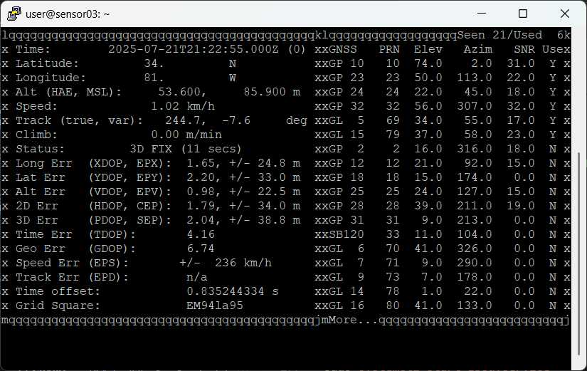

`Ctrl + C` to exit.

Now we want this to start automatically on boot. So we must create an override file for the gpsd service.

```bash
sudo systemctl edit gpsd.service
```

Copy the following at the top of the file between two comments that say `### Anything between here and the comment below will become the new contents of>` and `### Lines below this comment will be discarded`.

```
[Service]
ExecStart=
ExecStart=/usr/sbin/gpsd /dev/serial0 -F /var/run/gpsd.sock
Restart=on-failure
RestartSec=10
User=gpsd
Group=dialout
```

Now we need to stop any running gpsd instances to prevent any conflicts.

```bash
sudo systemctl stop gpsd.service
sudo systemctl stop gpsd.socket
sudo killall gpsd # Stronger kill, just in case
```
Now disable gpsd.socket
```bash
sudo systemctl disable gpsd.socket
```
Enable gpsd.service
```bash
sudo systemctl enable gpsd.service
```
Start gpsd.service to test
```bash
sudo systemctl start gpsd.service
```
Check the status
```bash
sudo systemctl status gpsd.service
```
Look to see that it is enabled and active. It should look like the following.

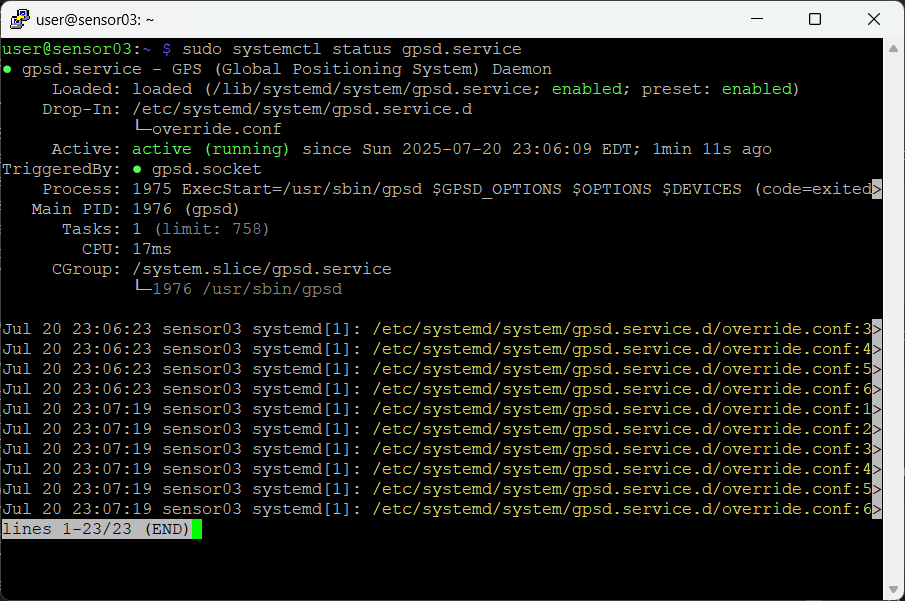

`Cntl+C` to exit. 

If issues arise examine the journal logs for gpsd.service
```bash
journalctl -xeu gpsd.service
```
Reboot the machine
```bash
sudo reboot
```
Reconnect using PuTTY

Now you should be able to run `cgps -s` when you are logged back in. If your GPSModule is flashing once every ~15 seconds, it has a gps fix. If you do not see any data in your terminal there may be an issue.

Finally we can test to make sure we can parse the GPS data.

Reboot the machine
```bash
sudo reboot
```
Activate your virtual environment
```bash
cd heat_project
source env/bin/activate
cd test_scripts/
python gps_logging.py
```

You should see that the Raspberry Pi is connecting to the GPS module, parsing the data, and writing to a log file. 

Now we can proceed to data logging.

# Datalogging
Now that everything is working. We can kick off our `capture_data.py` scripts to start writing data. 

If you just rebooted the machine or are in the root directory. You will need to change directories to the `heat_project` folder. The `capture_data.py` script is in the `src` folder. Before you run the file, you must activate your virtual environment. 

So starting from the top. Open the `heat_project` directory.

```
cd heat_project
```
Activate your virtual environment. 
```
source env/bin/activate
```
Run the Python script.
```
python src/capture_data.py
```

# Executing Scripts

# Helpful Linux/RasberryPi Command Line Interface (CLI) commands
```bash
ls

mkdir

sudo raspi-config

sudo # super user do

sudo reboot # reboot

date # gets date

nmtui # NetworkManager TUI

cd # change directory

i2cdetect -y 1 # Check to see what address I2C devices are using.

hostname -I # this will get your ip address.
```
